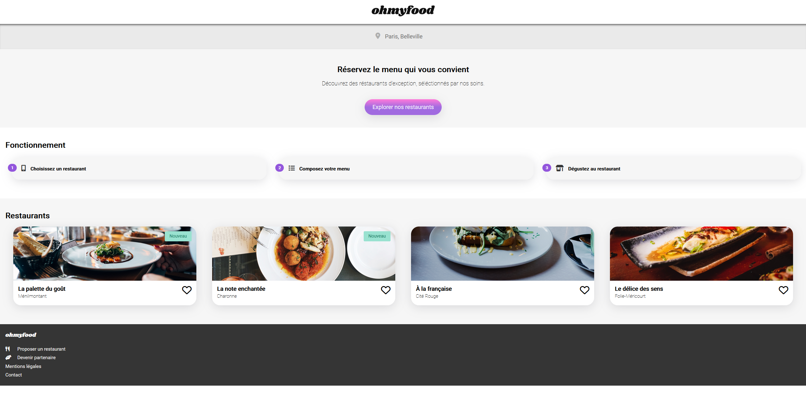

# Ohmyfood

languages : html/css | sass

description : intégration d'une premiere version du site  de commande de repas en ligne "Ohmyfood"

- Mettre en œuvre des effets CSS graphiques avancés
- Mettre en place une structure de navigation pour un site web
- Assurer la cohérence graphique d'un site web
- Utiliser un système de gestion de versions pour le suivi du projet et son hébergement
- Mettre en place son environnement Front-End

